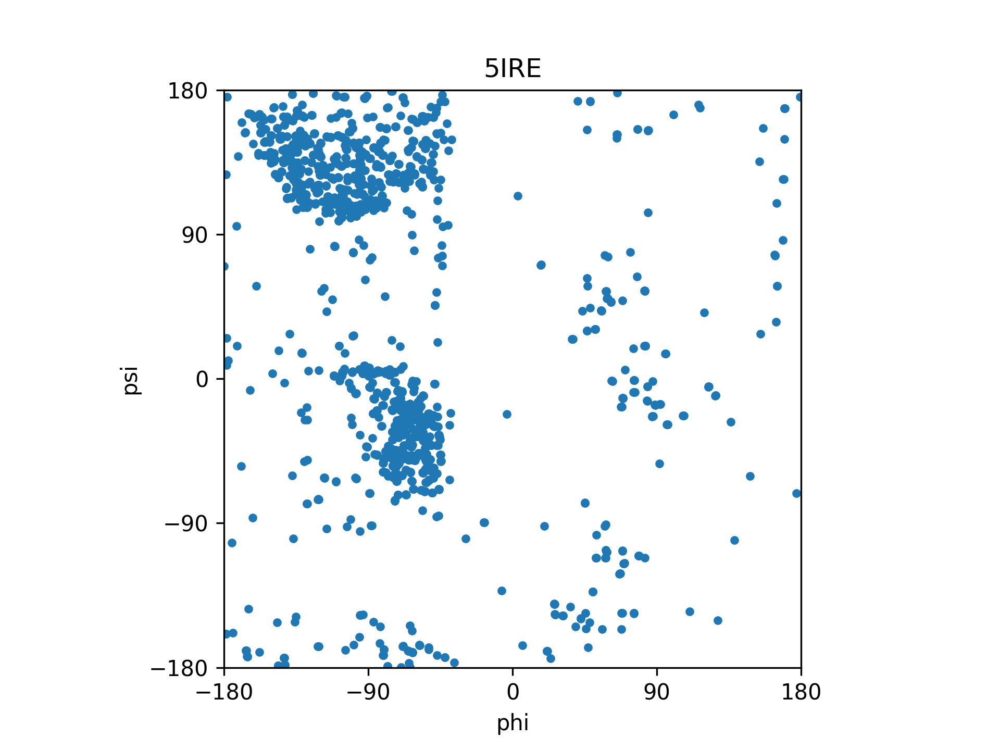

Zhoutao Zhang, Noel Kubach

# Assignment 02
## Task 3 - Ramachandran Maps

### Required packages
In out implementation we used `argparse`, `Bio` (biopython), `numpy` and `mathplotlib`.
These packages need to be installed in order to run our program.

### Usage
```
usage: RamachandranPlot [-h] -i INPUT [INPUT ...] -o OUTPUT

Plots a Ramachandran diagram to a output file.

options:
  -h, --help            show this help message and exit
  -i INPUT [INPUT ...], --input INPUT [INPUT ...]
                        Paths to .pdb files
  -o OUTPUT, --output OUTPUT
                        Paths to output PDF.
```
### Example
```shell
python kubach_ramachandran.py -i resources/1t8z.pdb resources/3gp6.pdb resources/5ire.pdb -o resources/ramachandran.pdf
```
Resulting PDF: [ramachandran.pdf](resources%2Framachandran.pdf)


